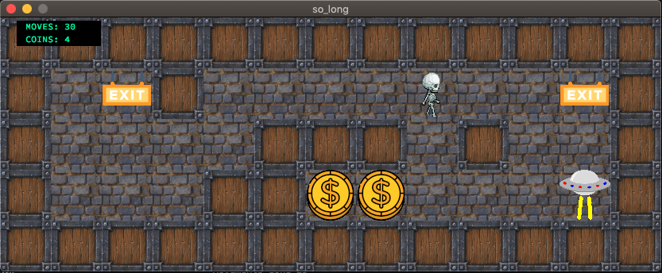

# Introduction
This project is a very small 2D game. It is built to make you work with textures, sprites. And some very basic gameplay elements.

## Usage:
- compile project
```
make bonus
```
- start game(the program accepts only one argument - the path to the map)
```
./so_long_bonus maps/bonus.ber
```
- you can change the map according to the following rules:
```
* map must be a rectangle
* only one player on the map
* at least one exit on the map
* '1' - wall
* '0' - floor
* 'P' - player
* 'E' - exit
* 'C' - coin
* 'K' - enemy

```
### Example
